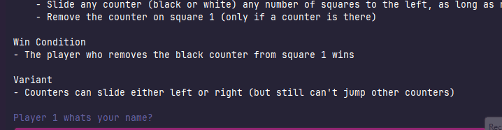
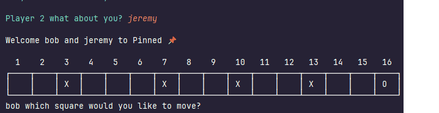
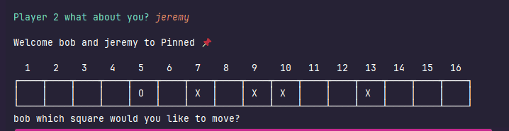
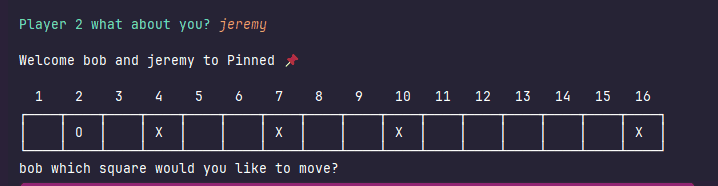

# Results of Testing

The test results show the actual outcome of the testing, following the [Test Plan](test-plan.md)

---

## Check for valid names
Testing if the user enters a valid name it continues with the code
### Test Data Used
A valid name/string eg. bob
### Test Result

It accepts the valid names for user one and two as expected
---
## Check if the counters move as expected
Testing if when you move a counter it selects and moves to the right space
### Test Data Used
Selecting a counter and selecting a space for it to move eg. 6 to 3
### Test Result

It moved the counter the user picked and moved it to the space the user picked
---

## Check if the game is winnable
Testing if when the black counter is selected when on number one on the board the player wins
### Test Data Used
Selecting the black counter on the very left of the board
### Test Result

It detected that the user selected the black counter on the lef tof the board and congratulates them for winning
---

## Check if the game can be replayed
Testing whether if the user chooses for the game to restart and play again as it once did
### Test Data Used
The user selected Y to the question whether they would like to play again
### Test Result

It detected that the user selected to play again and resets the board to give the ability to play once more
---

## Check if you can move a counter repetatively
Testing whether a counter can be moved constantly
### Test Data Used
selcecting the same counter and moving over and over eg. 7 to 6 then 6 to 4 then 4 to 1
### Test Result
[screenshots/canMoveSameCounterRepeadly-valid.gif](screenshots/canMoveSameCounterRepeatadly-valid.gif)
it detected that the user wanted to move a counter more than once so it moved it when requested
---